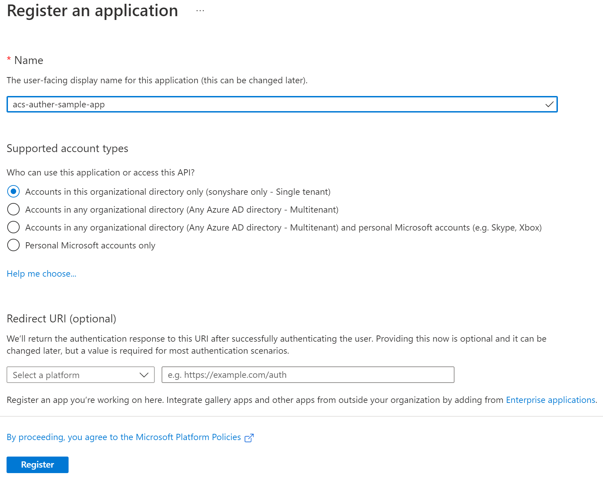
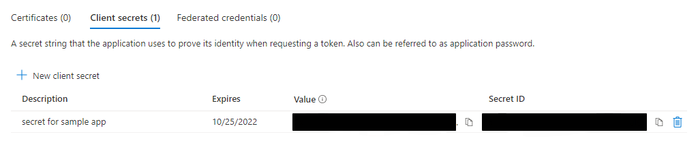
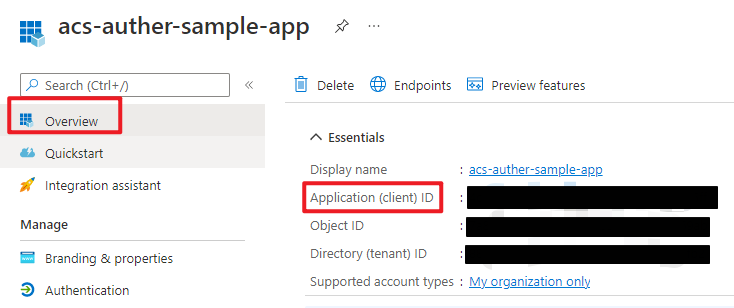
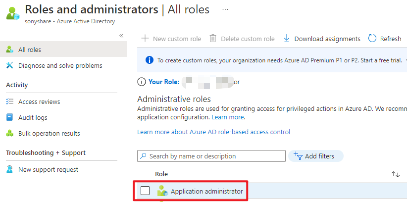
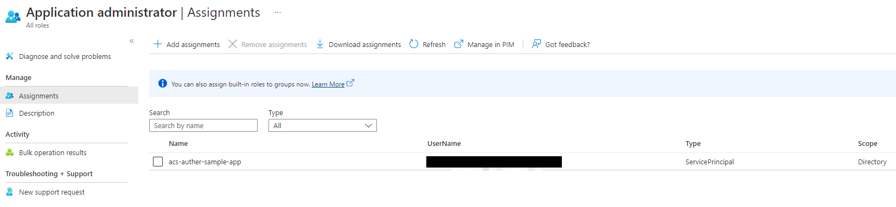

# Registering the sample apps with Microsoft identity platform and updating the configuration files using PowerShell scripts

## Overview

### Quick summary

1. Set the Execution Policy
   
   ```PowerShell
   Set-ExecutionPolicy -ExecutionPolicy RemoteSigned -Scope Process -Force
   ```
2. Copy the tenantId, clientId and clientSecret from your prepared app registration. Check content below to know how to create this app registration.
3. Run the script to create your Azure Active Directory application.
   
   ```PowerShell
   cd .\AppCreationScripts\
   .\ConfigureWithGraphAPI.ps1 -TenantId "your-tenant-id" -ClientId "clientid-of-your-prepared-app-registration" -ClientSecret "clientsecret-of-your-prepared-app-registration"
   ```
4. After running the script, there are manual steps presented on the PowerShell terminal if the script is completed successfully, please make sure to follow those.
   
## Goal of the scripts

### Presentation of the scripts

This sample comes with two PowerShell scripts, which automate the creation of the Azure Active Directory applications, and the configuration of the code for this sample. Once you run them, you will only need to build the solution and you are good to test.

These scripts are:

- `ConfigureWithGraphAPI.ps1` which:
  
  - creates Azure Active Directory applications and their related objects (permissions, dependencies, secrets),
  - changes the configuration files in the C# WebApi and Test MinimalClient JavaScript projects.
  - creates a summary file named `createdApps.html` in the folder from which you ran the script, and containing, for each Azure Active Directory application it created:
    - the identifier of the application
    - the AppId of the application
    - the url of its registration in the [Azure portal](https://portal.azure.com).

- `CleanupWithGraphAPI.ps1` which cleans-up the Azure Active Directory objects created by `ConfigureWithGraphAPI.ps1`. Note that this script does not revert the changes done in the configuration files, though. You will need to undo the change from source control (from Visual Studio, or from the command line using, for instance, git reset).

## How to use the app creation scripts?

### Pre-requisites

1. Prepare one app registration which will be used to create app registrations we need.

   (1) create one app registration
   

   (2) add one client secret
   

   (3) copy the clientid of this app registration
   

   (4) assign "Application Administrator" to the service principal of this app registration
   
   
   
2. Navigate to the root directory of the project.

3. Until you change it, the default [Execution Policy](https:/go.microsoft.com/fwlink/?LinkID=135170) for scripts is usually `Restricted`. In order to run the PowerShell script you need to set the Execution Policy to `RemoteSigned`. You can set this just for the current PowerShell process by running the command:
   
   ```PowerShell
   Set-ExecutionPolicy -ExecutionPolicy RemoteSigned -Scope Process
   ```

4. Go to the `AppCreationScripts` sub-folder. From the folder where you cloned the repo,
   
   ```PowerShell
   cd AppCreationScripts
   ```
5. Run the scripts.


> Note: You need to add service principal for Azure Communication service manually when it is not existed.
> 1. **Sign in with clientid/clientsecret of your prepared app registration**
>
>    ```PowerShell
>     az login --service-principal -u "clientid-of-your-perpared-app-registration"  -p "clientsecret-of-your-perpared-app-registration" --tenant "your-tenant-id"    --allow-no-subscriptions
>    ```
> 2. **How to check if service principal is existed**:
>    
>    ```PowerShell
>    az ad sp show --id "1fd5118e-2576-4263-8130-9503064c837a"
>    ```
> 3. **How to add service principal**:
>    
>    ```PowerShell
>    az ad sp create --id  "1fd5118e-2576-4263-8130-9503064c837a"
>    ```

Here are the details on how to do this.

```PowerShell
.\CleanupWithGraphAPI.ps1 -TenantId "your-tenant-id" -ClientId "clientid-of-your-prepared-app-registration" -ClientSecret "clientsecret-of-your-prepared-app-registration"

.\ConfigureWithGraphAPI.ps1 -TenantId "your-tenant-id" -ClientId "clientid-of-your-prepared-app-registration" -ClientSecret "clientsecret-of-your-prepared-app-registration"
```
