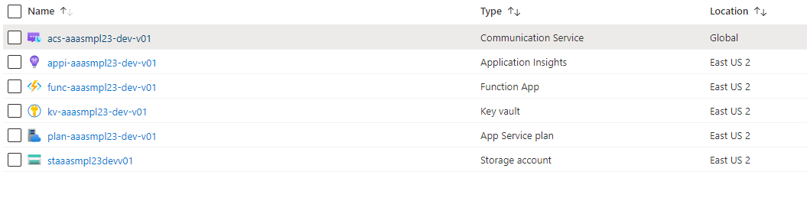

# Deploy  ACS Advanced Authentication Sample resource


## Required Azure Resources in the Sample
You can use `deploy-template.bicep` to deploy required Azure services for ACS Advanced Authentication Sample.

The bicep template will create following Azure resources: 
- Azure Communication Service 
- Azure Key Vault 
- Azure Storage 
- Azure Function App and its App Service Plan 
- Application Insight for the Azure Function



## How to provision ACS Advanced Authentication Sample resources Bicep


Use Bicep template  `deploy-template.bicep` to deploy required Azure services. 

__Step 1. Create a resource group__.

```bash 
az group create -l {resource-group-location}  -n {resource-group-name} 
```

__Step 2. Use Azure CLI and the template to deploy Azure services__ 

-  Preview what will be deployed/changed

```powershell
az deployment group what-if -f ./deploy-template.bicep -g {resource-group-name} --parameters environmentName={environment-name: dev, stg, prod} deploymentName={deploy-name} version={deploy-version} 
```

-  Provision the resources in the resource group 
```powershell
az deployment group create -f ./deploy-template.bicep -g {resource-group-name} --parameters environmentName={environment-name: dev, stg, prod} deploymentName={deploy-name} version={deploy-version} 
```